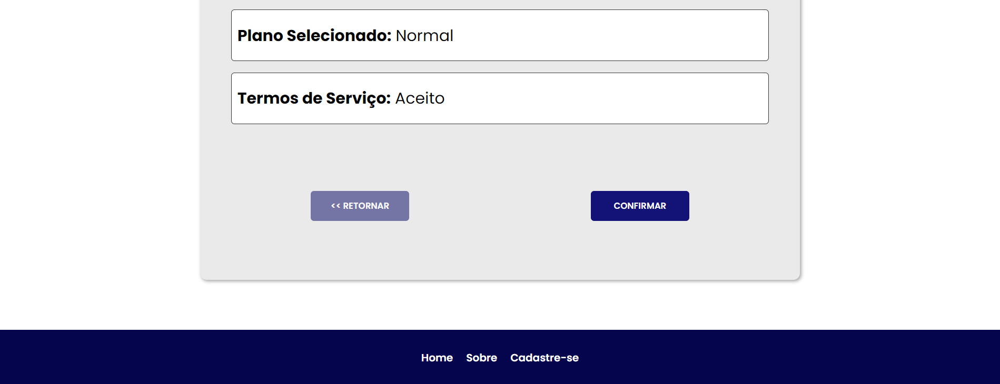

# Projeto de Desenvolvimento Web

Este é um site de planos de Internet, desenvolvido durante a disciplina de Fundamentos da Programação Web na PUC-PR (Pontifícia Universidade Católica do Paraná).

A proposta do projeto é o desenvolvimento de um site simples apenas com os conhecimentos básicos de HTML, CSS e JAVASCRIPT.

## Características

- Possui 4 páginas:
  1. **Home**: Apresenta a VelozNet e fornece três opções de planos de Internet.
  2. **Sobre**: Possui uma explicação sobre o site.
  3. **Cadastre-se**: Possui um formulário de cadastro com validações para as entradas do usuário.
  4. **Confirme seus dados**: Recebe os dados digitados no formulário de cadastro com o método GET e mostra no formulário para que o usuário possa confirmar ou retornar para a página de cadastro.

- Não é responsivo;
- Não possui Frameworks;

# Como Executar o Projeto:

1. Clone o repositório: 
git clone https://github.com/HagathaSilva/SiteBasico.git

3. Abra o arquivo `index.html` no seu navegador favorito.

## Organização do Projeto:

- **projetoVelosNet/**
  - *index.html*
  - *sobre.html*
  - *form.html*
  - *formAction.html*
  - **css/**
    - *style.css*
  - **midia/**
    - *img-principal.png*
  - **script/**
    - *script.js*
   
## Visualização do Projeto:
### Home:

### Sobre:

### Cadastre-se: 

### Confirme seus dados:

## Licença:

Este projeto é licenciado sob a [Licença MIT](./LICENSE) - veja o arquivo [LICENSE](./LICENSE) para mais detalhes.

